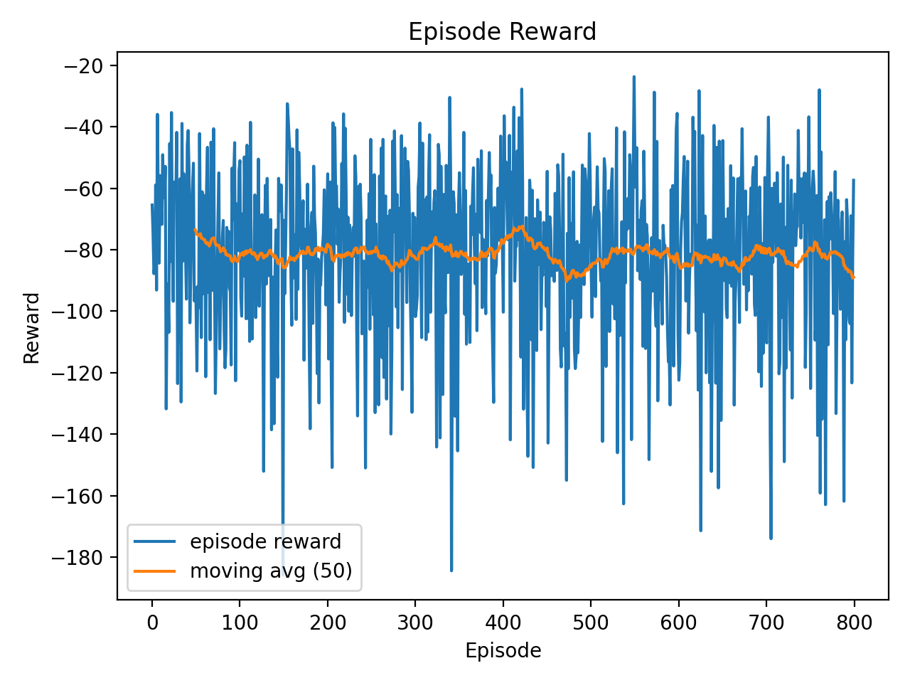
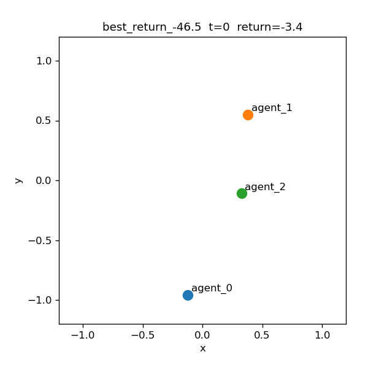
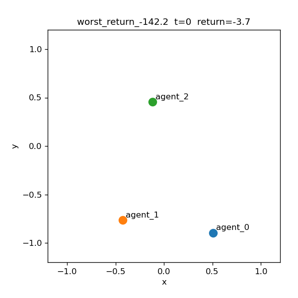

# Multi-Agent Reinforcement Learning: Algorithm Comparison & Coordination Analysis

This repository presents a **systematic comparison and analysis of multi-agent reinforcement learning (MARL) algorithms** in a cooperative environment, with a particular focus on **coordination stability and learning variance**.

Rather than optimizing a single algorithm for peak performance, this project investigates **why certain MARL approaches succeed or fail**, using **quantitative evaluation and qualitative visualization**.

---

## Project Motivation

Cooperation in multi-agent reinforcement learning remains challenging due to:

- Non-stationarity introduced by simultaneously learning agents
- Credit assignment ambiguity
- High variance in policy-gradient-based approaches

This project explores the following core question:

> **Is stable cooperation achieved through explicit structural constraints,  
> or can it emerge purely from learning signals?**

---

## Environment

- **Task**: Simple Spread (cooperative navigation)
- **Agents**: 3
- **Action Space**: Continuous `Box(0.0, 1.0)`
- **Objective**: Agents must spread out to cover landmarks while minimizing global distance cost

---

## Algorithms Implemented

### Independent Learning

- Independent DQN (IDQN)

### Value Decomposition

- VDN
- QMIX (centralized training, decentralized execution)

### Policy Gradient

- MADDPG
- MADDPG + Potential-Based Reward Shaping (PBRS)

---

## Training Setup

| Parameter       | Value   |
| --------------- | ------- |
| Episodes        | 800     |
| Steps / episode | 25      |
| Replay buffer   | 200,000 |
| Batch size      | 1,024   |
| γ               | 0.95    |
| τ               | 0.01    |
| Eval episodes   | 20      |

---

## Learning Dynamics

### Episode Reward Curve

The following plot shows **episode returns and a 50-episode moving average** during MADDPG + PBRS training:

**Observations**

- No clear convergence trend
- Large variance throughout training
- Occasional reward spikes indicate intermittent coordination

This suggests that **cooperation emerges sporadically rather than stably**.

---

## Evaluation Results

MADDPG + PBRS was evaluated over 20 episodes using deterministic policies (no exploration noise).

| Metric      | Value      |
| ----------- | ---------- |
| Mean return | **-87.9**  |
| Std         | **31.2**   |
| Best        | **-46.8**  |
| Worst       | **-160.2** |

The large standard deviation highlights **unstable cooperative behavior**.

---

## Action Distribution Analysis

To rule out numerical instability or policy saturation, we analyze the distribution of continuous actions.

**Key Insight**

- Actions are centered around **0.5**
- No saturation near boundaries
- Minimal clipping

👉 Instability arises from **coordination**, not from poor individual control.

---

## Trajectory Visualization (Key Contribution)

### Best-performing Episode

- Smooth, directed motion
- Partial role specialization
- Stable individual control

---

### Worst-performing Episode

- Agents move stably
- Lack of coordinated team strategy
- Inefficient global outcome

---

## Interpretation

Despite learning stable continuous control policies, agents fail to consistently coordinate.
This demonstrates a fundamental challenge in continuous MARL:

> **Stable individual behavior does not imply stable cooperation.**

Visualization reveals that learning instability originates from **multi-agent interaction dynamics**, not policy collapse.

---

## Key Takeaways

- Explicit coordination structures (QMIX, VDN) improve stability
- Policy-gradient MARL remains high-variance
- Reward shaping helps but is insufficient alone
- Visualization is essential for diagnosing MARL failures

---
